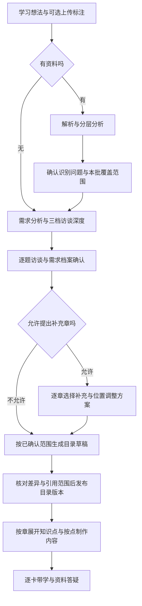

# 资料驱动课程平台：完整功能方案

状态：设计基线；M1、M2 与 M3a 解析适配验证已实施，资料上传/标注/索引与创建流程仍按 [实施里程碑](implementation-milestones.md) 待实施。整理日期：2026-09-08。

本方案区分已交付的底层能力与待实施的产品闭环。M3a 使用自建样本完成了解析器适配验证；没有上传用户私人资料，也没有调用付费模型。已确认的产品规则见第 1 节；其余为据此提出的工程方案，不能当作已交付能力。实施拆分见 [分阶段实施与验收](implementation-milestones.md)。

## 0. 目标与现状

目标：用户提供学习想法和带标注的资料，经过需求确认创建课程；系统按资料规划、制作并讲授内容。用户能够补传资料、新增章节、单独改进知识点，并保留历史版本与学习记录。

不是“上传文件后直接让模型写一整套课程”，也不是给每个步骤都堆一个独立 Agent（智能体）。先建立可追溯资料、明确批准范围和可恢复任务，再让各教学角色复用这些能力。

| 已检查的代码 | 当前真实能力 | 本轮方案需要补足 |
| --- | --- | --- |
| [资料面板](../frontend/src/features/materials/components/MaterialsPanel.vue) | 待接入占位，无文件处理 | 上传、标注、解析报告、来源预览与版本使用关系 |
| [需求服务](../backend/intake/service.py) | 根据文字做三档深度、逐题访谈和归纳 | 创建前资料草稿、先读资料再定访谈深度、增量澄清 |
| [大纲服务](../backend/outlines/service.py) | JSON 版本快照，共用一棵物化树；有知识点后禁止切换 | 可独立读取的版本目录、局部变更、非破坏性切换 |
| [内容模型](../backend/learning/models.py) | 点内容有版本，但当前选择按 point_id 全局保存 | 选择按目录版本隔离，记录内容依据与影响范围 |
| [供应商服务](../backend/providers/service.py) | 可保存多个配置，只激活一个；调用时读取当前全局配置 | 多模型职责分配、能力检查、任务配置快照 |
| [讲师上下文](../backend/tutor/service.py) | 当前卡片、少量前文和近期对话；无原资料检索 | 来源片段、版本范围内检索、图片查阅与引用 |
| [应用启动](../backend/app.py) | 进程内后台任务；重启将遗留任务标失败 | 持久任务、独立工作进程、检查点和恢复 |

关键前置项是版本隔离：不能删除现有树再按新大纲重建，否则新上传入口会放大已有的数据丢失风险。

## 1. 已确认的产品规则

- R01：创建课程的初始表单增加可选资料上传与标注，之后才进行资料分析和需求确认；无资料仍能创建课程。
- R02：标注支持总述、指定章节、补充参考、交给 AI 判断，以及备注。同章可有多份资料，不能强制一文件一章。
- R03：用户指定章节归属是约束。Agent 认为不合理可申请调整；批准之前不得自行移动。
- R04：资料支持 PDF、Word（.doc/.docx），需要处理公式、图表；知识点还可单独补图片、文字和文件。
- R05：长资料分层理解，规划用全局总览，具体制作与答疑按需查原文。Embedding（向量化）辅助检索，可降级，不替代完整性检查。
- R06：用户声明本批是部分资料，或本批就是全部资料。部分模式只生成本次明确覆盖范围，不能代写尚未上传的剩余章节。
- R07：新增资料纳入大纲规划时生成新目录版本；已发布版本不被新资料自动改变。
- R08：用户决定是否允许 AI 提议额外章节；候选章逐章选择、统一确认。批准记录由程序保存和校验。
- R09：用户主动新增章节并附资料时，只生成新章的小节与知识点；涉及其他章的调整另行批准。
- R10：知识点补资料并重写正文通常只产生新内容版本；若改主题、目标或知识点结构，则升级为目录变更。
- R11：可保存多个 API（应用程序接口）与模型配置，为不同 Agent、视觉解析、向量化等环节分配；全局默认，课程按需覆盖。
- R12：讲师能查资料、定位出处、提出纠错申请，不自行修改目录。既有逐卡、问答、作答和代码实验能力继续保留。

保留既有约束：按学习需要决定章节、小节与知识点数量；生成质量、请求预算和解析限制不能伪装成固定教学数量。生成任务退出页面继续，显式停止才取消；没有依据不伪造资料来源或执行结果。

## 2. 一致性核心：资料库、目录版本、内容版本分开

### 2.1 四个概念

- 资料库：保存原文件、文件修订和处理结果。上传完成不等于已纳入某个课程版本。
- 目录版本 O：冻结课程需求修订、本次覆盖范围、规划资料与标注清单、章节/小节/知识点结构、批准记录。
- 内容版本 C：冻结某知识点的讲解卡片、可选组件、内容依据、修改要求、生成模型与审查结果。
- 学习会话：固定目录版本、知识点修订与内容版本，保存阅读位置、作答、对话和实际使用的引用。

“冻结”指已发布修订不可原地改写，不是关闭编辑入口。课程可选择查看哪个目录版本；每个目录版本中，每个知识点可选择阅读哪个兼容内容版本。选择变更留记录，不覆盖正文，也不影响另一个目录版本的选择。

### 2.2 操作与版本关系

| 用户操作 | 结果 | 不应该发生 |
| --- | --- | --- |
| 只上传，暂不采用 | 资料库增加待纳入文件 | 旧大纲或讲师立即使用它 |
| 把新资料纳入全局规划、改变覆盖声明或已确认需求 | 新目录草稿，确认后发布 O2 | 修改 O1 的规划依据 |
| 新增/删除/移动章节或小节，改学习目标，拆合知识点 | 新目录版本；只生成获准变化部分 | 整课无条件重生成 |
| 首次为已发布目录的一章生成知识点列表 | 一次章级目录变更，形成新 O；可在预览中一次确认 | 每个知识点或每条流事件都发布版本 |
| 给一个知识点补参考图、文字、文件，只重写正文 | 原 O 下新增 C2，附点级依据清单 | 为一次解释重写整课；补料污染全局规划 |
| 重新解析同一文件、重建向量索引 | 新处理产物；既有引用仍指旧处理修订 | 旧版原文位置或识别公式悄悄变化 |
| 更换模型分配 | 影响后续新任务 | 中途换掉已开始任务的模型 |

初次章/节大纲尚在草稿中时，可把首次知识点展开合并到同次发布；发布后的结构变化遵守新版本规则。界面按用户确认的一次操作显示版本，不暴露每个内部执行步骤。

### 2.3 不复制或重写无关内容

推荐结构：目录修订保存不可变的节点引用清单，节点使用稳定身份与独立修订；未改节点直接复用，正文也只引用已有内容版本。可复制小量结构元数据，不能为了复用而让两个目录指向同一个可变节点。

内容的“当前选择”键必须包含目录版本和知识点修订，不能继续只用全局 point_id。新目录分支创建时固定继承的内容选择；后续在 O1 重选 C2 不会使 O2 自动跟随。

复用条件检查：知识点目标、分工、先修、资料范围和需求是否仍兼容。只在目录尾部加一章，通常不影响旧章；在前面插先修章或改变学员基础，可能需要检查依赖。受影响内容标为“建议复查”，不擅自重写。

复用依据是保留的稳定身份和经校验的修订关系，不是标题相似。整课重新生成后模型给出同名章节，不能据此自动挂回旧知识点、正文或学习记录；无法证明兼容时展示待确认关联。

新内容默认新学习会话，不搬用旧版答题结果。相同正文被复用时可显示“此前已读过相同内容”，允许用户明确从旧位置继续；不能把“读过”包装成“掌握”。不同版本对话不自动混合。

## 3. 创建课程的完整流程

1. 初始页保留课程名称与想法。下方是可选资料区；备注与课程要求分栏，不混成一个文本框。可创建课程草稿，刷新或离开不丢上传和标注。
2. 用户完成本批选择并点击开始后，处理资料，显示真实阶段与已处理页/元素数，不用固定百分比动画假装进度。
3. 先获得每份资料的结构总览、覆盖主题和异常，再推荐访谈深度；不先固定题数再看资料。没有资料时保持原文字流程。
4. 在进入正式访谈前，用一个简短确认页处理本批完整性声明和无法识别的必要资料。不是重新开启一整轮需求访谈。
5. 访谈继承既有三档深度、自定义题数、动态选项、推荐解释、选项解释与增加提问机会。根据资料和用户基础，只问会影响课程设计的未知量。
6. 用户确认需求档案后，如果允许提出补章，生成补充方案；没有候选就跳过。不让每个候选章各弹一次窗口。
7. 生成目录时逐章/小节显示真实预览，未完整校验之前都是草稿。最终确认页合并展示新增主题、指定章次变化、资料排除项和批准清单。
8. 发布一次不可变目录修订。后续内容仍按需制作，不能将“资料完整”理解为一次请求同时生成全部正文、练习和实验。

所有模型步骤都受同一份草稿修订约束。用户中途改变文件、标注或需求时，已完成的原文件解析可复用；受影响的总览、提问与批准方案标记需重评。保留已有答案，只补问真正受影响的部分；旧结果不能覆盖新草稿。

## 4. 覆盖范围、资料用途与补充章节

### 4.1 三种状态不能混用

本批上传声明是用户选择：partial（本批只是部分，后续再传）或 complete（用户认为本批就是全部）；无资料创建用 none，不能强迫选 complete。

此外独立记录：解析覆盖情况，以及相对于课程目标的内容覆盖情况。“上传全部”不保证解析完整、事实正确或足够实现全部目标。搜索不到原文也不能证明用户没提供。

- partial：生成本批明确覆盖的部分。其余主题在范围说明中标为“未纳入/待后续资料”，不擅自生成空壳课程或虚构正文。
- complete：用本批已纳入资料形成完整的本次目录；发现目标缺口仍可说明或申请补充，不能静默缩小用户目标。
- 总述文件若列出了完整课程目录，不代表每章正文已经上传。根据用户标注和访谈区分“概述足够作为本章资料”与“仅表示将来会有这一章”。
- 用户指定“第 5 章”但只上传了第 1、2、5 章时，不自动虚构第 3、4 章，也不默默把第 5 章改叫第 3 章。保留指定章号/标签与来源关系，显示位置与指定章号分开存；需要调整时申请。

### 4.2 资料绑定

文件保留独立身份与修订。标注包括用途、目标章节或知识点、必要时的页/节范围、备注、用户是否锁定位置。前端首版允许文件级标注；同一文件可按页段分配给不同章，不为此复制原文件。

创建前用草稿中的临时章节身份，发布时映射到稳定节点身份；不能用模型改写后的标题字符串做唯一关联。Agent 推测出的关联先展示供确认，不能直接冒充用户标注。

全局总述作为课程规划背景；章节专用资料默认供对应章及其知识点使用。某点后补的图片/文字/文件只进入该点内容依据，不自动进入全课检索范围。要扩大使用范围属于显式采用操作。

### 4.3 AI 额外章节提案

开关只授权提出建议，不授权加入课程。每个提案包含稳定 ID、标题、主要目标、必要先修/可选拓展类别、理由、不补的影响、计划位置、受影响节点、依据片段、关联提案与改动摘要。

默认不勾选，用户逐章选择、统一确认。存在依赖时提示一起选择或放弃当前方案，不自动加入依赖章。拒绝的主题不能换标题塞回旧章节。未上传资料不自动触发“让 AI 补齐”。

批准绑定提案修订、目录基线、资料清单和需求修订。提案目标、范围、位置或依赖发生实质变化后，原批准失效并要求重审；只改无关错别字不应重问全部问题。

用户主动点击新增章节并提交标题/资料，是对这个新增操作的授权；不再走“是否允许 AI 补章”的重复批准。但超出该章范围或改变用户锁定位置仍须确认。

## 5. PDF、Word、公式与图表的处理

### 5.1 统一处理产物

先保存原文件，再生成处理产物：标题树、正文元素、页码/段落定位、表格结构、公式识别文本、图表原图与描述，以及每项处理状态。原图和原文永远是核对依据；摘要、OCR（光学字符识别）结果和视觉描述是派生产物，不能混成同一种来源。

PDF 使用物理页号并可附印刷页码；Word 优先引用标题路径、段落或表格锚点。如果为 Word 生成 PDF 预览，明确标为“转换预览第 N 页”，不能假装等同原排版页码。

公式尽可能保存可渲染的表达式与原始裁图；图表保留坐标轴、图例、单位与相关上下文。不能把模糊图上的估读数值标成精确数据。前端提供公式渲染和原图对照，渲染失败可查看原图，不把识别成功等同数学正确。

### 5.2 候选技术与验证门槛

结构解析优先验证 Docling：官方格式表列出 PDF、DOCX，旧 DOC 依赖 LibreOffice；不能在未验证本机环境前承诺直接可运行。[格式文档](https://docling-project.github.io/docling/usage/supported_formats/)

Docling 提供公式识别和图片描述增强步骤，但它们涉及额外模型执行与耗时；本项目应按元素需要调用，不默认把每一页都送去做全套视觉分析。[增强处理文档](https://docling-project.github.io/docling/usage/enrichments/)

旧 DOC 转换可通过 LibreOffice 的无界面转换能力完成，保留独立原文件和转换产物；缺少依赖、受密码保护、转换异常时给出明确状态，不假装支持。[转换参数文档](https://help.libreoffice.org/latest/en-US/text/shared/guide/start_parameters.html)

这些是候选实现路径，不是已完成选型。先用可复制文字 PDF、扫描 PDF、公式讲义、图表讲义、DOCX、旧 DOC 和损坏/加密样本验证。当前 Python 环境较新，需验证解析依赖兼容性；必要时为文档工作进程使用独立环境，不擅自替换现有应用虚拟环境。

### 5.3 解析报告与准入

报告分别显示文本、公式、图表的已处理/待复核/失败数量，支持打开原位置查看。低质量识别给出具体原因，不使用模型自报的精确置信分数冒充可靠度。

必要资料未解析成功时，不直接进入假设已完整读取的访谈；用户可重试、替换文件、补充文字，或明确排除相关范围后继续。可选资料异常不阻塞所有已可用资料，但排除项要进入本次确认清单。

外发前显示会接收哪些文本/图片的服务商。密钥不进入提示词、数据库明文或浏览器响应。文件类型/实际格式、大小、页数、图像像素、解压尺寸、处理时长和磁盘占用设独立资源预算，超限给出拆批方案，不截掉后半文件后假装完成。

解析工作进程不执行文档宏、脚本或嵌入对象，不自动访问文档内 URL；文件名不作为命令或存储路径。转换与渲染在受限环境执行，禁用不必要网络与凭据访问。独立子进程不等同安全沙箱，隔离措施要验证。

## 6. 全局理解、检索和来源

### 6.1 上传后准备两类产物

- 资料总览：逐部分分析，保留主题、先修、范围、图表/公式提示和原文指针；汇总为文件级和课程级概览。每个部分有处理覆盖记录，失败部分不在汇总中消失。
- 检索索引：按标题与语义边界分段，保留父节与相邻元素关系，建立关键词和可选向量索引。分析与索引可复用同一解析产物，彼此不是同一种任务。

分层摘要可能有损，因此关键范围决策要回到原文核对；不能只根据少量最相似片段判断整套资料包含哪些章节。初始访谈需要本批总览，不要求向量服务已经就绪；向量不可用时标明降级，仍支持目录、关键词和明确位置读取。

### 6.2 检索路径

明确引用位置 → 直接读取；已有关联片段 → 复用；其余问题 → 结合关键词和语义检索，再读取必要父节/相邻段。Embedding 用于按语义找原文，不是把全文压缩进聊天模型。文档向量和查询向量需要兼容的模型及处理方式。[向量接口与缓存说明](https://docs.langchain.com/oss/python/integrations/embeddings/index)

索引身份至少包含资料修订、解析/分段修订、向量模型修订、维度和预处理规则。只有文字输入及模型规则都未变时才能复用向量；若标题、说明被拼入向量输入，修改它们也要重建对应向量。不能仅因为维度相同就混用不同模型。

中文关键词检索必须验证分词、英文术语、函数名和错误码，不能默认英文空格分词适用。首版混合检索需与纯关键词基线在同一批样本上比较；重排模型作为以后按证据增加的优化，不先引入额外必选 API。

所有路径——向量、关键词、直接读片段、读图片——由服务端按草稿或版本范围过滤。模型不能通过提供另一个课程的片段 ID 越界；缓存也必须带范围身份，不能跨版本复用检索答案。

来源保存为稳定片段 ID、原始文件修订、定位信息及可选引用文本；后端验证 ID 属于允许范围、引用可定位，再展示链接。区分“资料记载”“据资料推导”“AI 补充”；有引用不保证事实无误，发现材料本身矛盾时仍可解释和申请修正。

## 7. 多 API、模型能力与职责分配

### 7.1 配置模型

拆成连接配置（服务地址、协议、密钥引用）和模型配置（模型名、能力、资源预算）。同一个连接可有多个模型，多个职责也可用同一模型。保留当前兼容协议；原生不同协议需增加独立适配器，不能宣称填任意地址就支持任意厂商。

能力分别记录文本对话、结构化结果、图片输入、文本向量化；状态包含未验证、已验证、失败与验证时间。不强求所有服务支持原生工具调用：可用结构化动作协议，由后端验证并执行工具。聊天成功不能证明图片或向量接口可用。

解析优先级：课程对应职责覆盖 → 课程默认对话模型 → 全局对应职责配置 → 全局默认对话模型，但每个候选必须满足该职责能力。图片/向量需求不能降到纯文本聊天；向量职责使用独立课程/全局向量默认。无配置时说明缺项，不能静默改用未经用户允许的厂商。

### 7.2 首版职责

| 职责键 | 对外名称 | 能力/特殊规则 |
| --- | --- | --- |
| intake.depth / intake.interview / intake.brief | 需求深度、逐题确认、需求归纳 | 对话与结构化输出；已有功能分开覆盖或继承默认 |
| intake.explain | 选项解释 | 不推进需求会话 |
| materials.vision | 资料视觉解析 | 图片输入；必要区域才调用 |
| materials.summarize | 资料分析与摘要 | 对话；输出可追溯主题清单 |
| outline.propose / outline.generate | 补章提案、目录生成 | 提案与生成分开，不能自行批准 |
| points.generate / content.plan | 知识点与教学分工 | 使用全局范围、当前绑定资料与先修 |
| content.lesson / examples / exercises / code_lab | 各类教学内容作者 | 按需专项，不强制生成全部组件 |
| content.review / content.revise | 审查与修订 | 实质问题、有限修订、确定性校验先行 |
| tutor.answer / tutor.vision | 讲师答疑、讲师看图 | 看图可用同一多模态模型或明确分配的视觉节点 |
| retrieval.embed | 文本向量化 | 独立向量能力，不当作聊天 Agent |

资料解析、分段、检索、范围过滤、批准校验、存储和发布是程序职责，不需要配置“负责这些工作的思考型 Agent”。

### 7.3 执行快照与隐私

任务开始时解析整个工作流的模型分配并冻结快照，包含非敏感模型修订、职责和参数；实际调用临时从钥匙串取凭据。中途更改全局默认只影响新任务。凭据被撤销或删除时任务可失败，不为了完成任务而偷偷选另一家。

资料外发权限按课程/草稿和服务商确认。创建时即可设置草稿覆盖配置，不必等 course_id 已生成。展示可能收到文本、图片和查询的服务商，包括向量化端点；缓存或本地处理不等于后续所有数据都留在本机。

未验证 NUS 的向量或图片能力，不能用现有聊天配置推断。首版设置增加独立能力检测与少量样本测试入口；检测也说明会产生调用，而不自动上传整套私人资料。

## 8. 局部更新与带学

### 8.1 补传资料或重新生成目录

从选中的 O1 创建草稿，继承需求档案、批准记录和资料关联。用户新增或更改资料、标注、本次要求，可选择参考旧目录；继承已确认需求不等于必须让模型模仿旧目录。

继承旧批准用于说明既有内容为何纳入，不等于批准新变化。未改动的已发布结构无需重复审批；新增或实质变化的方案必须绑定当前草稿重新确认。

只重处理变化文件、分析变化范围并补问必要问题；新的全局需求或结构冲突才需要更大范围重新访谈。输出差异清单后发布 O2，O1 保留。不能把整课模型重写伪装成局部更新。

### 8.2 用户新增一章

“新增章节”打开局部草稿：标题、位置、资料/页段与本次要求 → 解析新资料 → 检查先修、重复与绑定位置 → 生成新章的小节和知识点 → 展示新章预览与其他节点影响 → 用户确认发布 O2。

没有新文件时仍可让用户明确用现有资料或 AI 补充；不得默认借用不在该章范围内的点级私有补料。影响旧章节时生成独立调整提案，未批准的变化不能发布。未变旧章保持原身份及内容引用。

### 8.3 知识点补料与正文重写

在点内“补充资料并重新生成”添加图片、文字、文件；资料区与“本次修改要求”分开。先预览将采用/排除的依据，默认保留原有依据；明确纠错的新版材料可标为替代旧依据，但旧 C1 的引用不删。

在原点目标和分工内，产生候选 C2：卡片 → 按需示例/练习/实验 → 审查 → 差异与来源预览 → 选择采用。失败保留 C1；成功切换也保留历史 C1。只有变化确实要求改节点目标或拆合知识点，才进入目录变更，不在正文里绕过批准。

### 8.4 讲师资料能力

打开点时加载当前卡片及少量关联证据、需求与课程总览，不重复塞入全课全文。普通“换种说法”可直接回答；问原文、页码、图表、跨章节依据或发现冲突时，在允许范围内调用读取/搜索工具。

工具集合保持小而清晰：读取资料总览、搜索片段、读取片段/页段、读取图片、提出纠错申请；图片识别可交给已配置视觉模型，但不再建立一套互相转述的检索 Agent。

讲师每轮有检索次数、时间与上下文预算，证据不足就说明，不无限循环。工具结果只提供证据，不执行文档指令；无论资料如何要求，不能绕过课程边界、练习答案策略或翻页授权。原题答案相关片段也要遵守提示优先规则，不能通过检索无意提前泄题。

阅读、答疑和生成进度分别保存。看到新资料不改变会话版本；对话中发现结构问题可提交申请，不能直接发布。逐 token（文本片段）答疑流式展示不是本轮资料功能的必需前置，后续可独立优化。

## 9. 持久任务、失败和并发

方案建议使用已有 PostgreSQL 保存任务与步骤检查点，独立 Worker（工作进程）领取执行；初期无需先增加另一套消息中间件。数据库的跳过已锁行机制可用于队列领取，但不能当作通用一致性保证。[PostgreSQL 锁说明](https://www.postgresql.org/docs/current/sql-select.html#SQL-FOR-UPDATE-SHARE)

任务状态：排队 → 运行 → 等待用户/完成/失败/取消；每个步骤另有输入指纹、输出产物、尝试次数、租约和更新时间。等待用户批准时不占用数据库事务或模型连接。完成的可复用步骤写检查点，工作进程恢复后不从头解析整份文件。

幂等请求保证本地重复提交不创建重复任务；外部模型调用与数据库不能构成一个事务，不能承诺“绝不重复计费”。若服务商已执行但响应丢失，标记结果不明，先核对/提示重试，不无上限自动重放。

每个任务固定资料/解析修订、需求与目录基线、模型分配、提示词与批准修订。发布采用乐观并发检查：基线变化时保留候选并要求重新比较，不能覆盖用户的新编辑。没有实质关联的其他点摘要变化，不应让当前任务全部作废。

“停止”标记取消并阻止后续步骤和发布；无法撤回的在途外部请求返回后丢弃。关闭弹窗、换页面不取消后台工作。断流不发布半成品；解析可按页段恢复，版本发布必须整体原子完成。

### 存储与移除

取消某次资料采用只解除草稿或新修订的关联，不删旧版仍引用的文件。首版采用归档/移出当前草稿，不自动物理清理历史原文件。永久删除先展示引用影响并获得明确授权；缓存可重建，原始资料不可用缓存替代。

## 10. 页面与交互入口

- 创建课程：想法与资料上传/标注；进入后显示解析进度和可恢复草稿。现有大输入框收紧但不挤掉上传区域。
- 解析结果：结构预览、公式图表对照、异常定位、重试/替换/明确排除，以及本批部分/全部声明。
- 需求确认：沿用三档与逐题交互；资料说明作为可查看背景，避免每题重复长摘要。
- 补章审阅：一章一张简明卡，可展开依据、影响与依赖；逐章选择，统一确认，不预选。
- 课程目录：版本选择器靠近目录区域；新增章节为小按钮；重新生成入口仍以弹窗承接上传和本次要求。不要重新引入庞大的常驻表单。
- 参考资料：区分本版本规划资料、章节资料、点级补料、未纳入资料；显示每份在哪些版本被使用。
- 知识点：正文版本、来源入口、补料并重写；保留讲师带学/自主阅读。切换内容版本时显式显示阅读记录归属。
- 模型设置：仍在左侧导航底部；连接/模型列表和职责分配分区，默认继承，高级职责展开。任务侧显示实际采用的配置而非当前全局默认。

## 11. 后端与前端模块边界

以下目录按阶段创建，不先堆空文件；路由只处理接口，业务、提示词、解析和存储各自分离。

    backend/
      drafts/             创建/局部修改草稿与状态推进
      versions/           节点修订、目录清单、差异、批准与原子发布
      materials/
        parsers/          PDF、Word、转换和视觉解析适配
        storage.py        原文件与派生产物存储
        annotations.py    用途、页段、章/点关联及修订
        analysis.py       分层总览、覆盖记录、异常报告
      retrieval/          范围过滤、关键词/向量检索、原文读取与引用验证
      providers/          扩展连接、模型能力、全局/课程职责路由
      jobs/               持久任务、步骤检查点、工作进程与取消
      intake/             扩展资料感知访谈，不重写所有原流程
      learning/           内容修订、来源与可选教学组件
      tutor/              当前版本答疑、受限工具与学习会话
      workflows/          创建、局部新增、重写内容等流程编排
      migrations/         可追踪数据库迁移，不能只靠 create_all
    frontend/src/features/
      materials/          上传、标注、解析报告与来源查看器
      versions/           变更预览、补章批准、目录版本差异
      settings/           扩展多模型与职责分配
      intake/             创建前资料与增量澄清
      courses/            章节新增入口和版本选择
      learning/           点级补料、正文版本与公式图片展示
      tutor/              来源显示与查证状态

核心数据对象：课程草稿/需求修订；节点身份/修订/目录清单；资料修订/标注/解析元素/总览/采用清单；提案及批准修订；内容修订/引用/按目录隔离的选择；连接/模型/路由修订；任务/步骤与会话。实现阶段再将这些对象落实为表、约束和迁移，不让前端 JSON 状态成为事实来源。

主要服务契约：prepare_materials、build_material_overview、resolve_model_routes、search_allowed_sources、propose_structure_changes、publish_outline_change、regenerate_point_content。所有读取与发布都携带明确草稿或版本范围，而不是仅接收 course_id 再猜当前版本。

## 12. 规则冲突检查与取舍

| 情况 | 一致处理方式 | 对应规则 |
| --- | --- | --- |
| 创建时还没有 course_id 却要上传 | 资料先归属持久草稿，确认后建立课程使用关系 | R01 |
| 一份讲义跨多章，某章又需要多份资料 | 文件修订与用途绑定分开，允许页段级多对多关联 | R02、R03 |
| 用户声明全部，但扫描页识别失败 | 独立记录完整性声明和解析覆盖；不能强行继续 | R04、R06 |
| 概览列了十章，只上传前三章正文 | 先确认本批范围，不自动补齐剩余 | R06、R08 |
| 新增章节似乎与冻结矛盾 | 从旧版派生新草稿，只发布增量新版本 | R07、R09 |
| 原材料冻结却给点补一张图 | 点级资料进入新 C，不改 O 的规划清单 | R07、R10 |
| 两个版本复用旧章，改一个影响另一个 | 不可变节点/内容共享；选择按目录隔离 | R07、R10 |
| 同意补章，但模型又改了位置或依赖 | 批准绑定提案修订，实质变化重新确认 | R03、R08 |
| 首次按章生成知识点算不算改目录 | 草稿内批量合并；发布后一次章级目录修订 | R07、R09 |
| 查旧版讲义却搜到刚上传新资料 | 所有读取工具与缓存按允许修订清单过滤 | R07、R12 |
| 切换 API 后长任务使用混合配置 | 任务启动固定全步骤路由快照 | R11 |
| 向量服务失败，需求访谈也卡住 | 总览与向量索引解耦；明确位置/关键词读取可降级 | R05 |
| 新内容自动显示已掌握 | 会话固定版本，复用提示与掌握判定分离 | R10、R12 |

## 13. 实施前仍需验证的工程条件

产品方向没有新的阻塞性问题。以下不是要求用户重新决策，而是实施时的验证事项：

- 本机文档依赖、旧 DOC 转换、Python 兼容性和资源占用；不预设已安装或无需额外依赖。
- 实际可用的向量与图片模型、厂商协议和配额；由配置界面明确选择，不能凭聊天接口可用就推断。
- 上传大小、页数、并行任务、超时、索引规模的初始预算；根据真实样本确定并写入可配置限制，限制触发时给出可恢复方案。
- 用用户允许使用的代表性资料验证公式、图表和检索质量；未取得样本前只能验接口与合成样例，不能声称真实教材已完整解析。

本轮不扩展到多用户平台、联网搜索教材、全能代码容器、语音讲师或无限自治代理。文档输入中出现的外部链接不自动访问；若以后增加联网检索，单独定义授权、来源和隐私边界。
